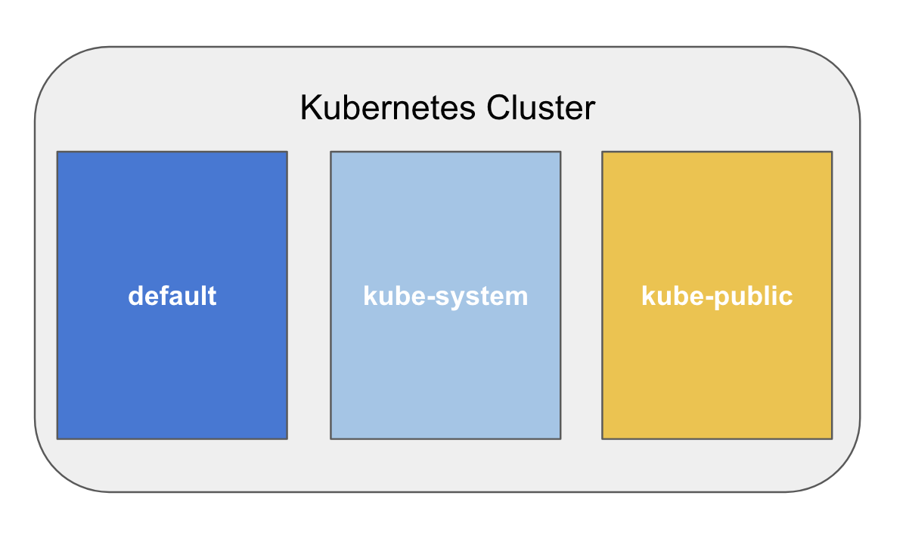

<style>
img[alt~="center"] {
  display: block;
  margin: 0 auto;
}
div.twocols {
  margin-top: 35px;
  column-count: 2;
}
div.twocols p:first-child,
div.twocols h1:first-child,
div.twocols h2:first-child,
div.twocols ul:first-child,
div.twocols ul li:first-child,
div.twocols ul li p:first-child {
  margin-top: 0 !important;
}
div.twocols p.break {
  break-before: column;
  margin-top: 0;
}
</style>


<div align="center">

Kort presentation av kubernetes

</div>


---

# Vad är kubernetes?

* Orkestrering av containers i ett kluster
* En komplett driftmiljö
* Open source, stort ekosystem
* Linux native
* Skapades av Google (project Borg)
* Namnet Kubernetes förkortas ofta till k8s

---

# Var finns k8s?

Tillgängligt hos de flesta molntjänstleverantörer och on premise

* Google cloud services GKE
* Azure AKS
* Amazon EKS
* Open Shift (On premise)
* Kan köras på riktig plåt eller VM

---

# Köra k8s lokalt för utveckling

* Docker desktop har inbyggd k8s (https://www.docker.com/products/docker-desktop)
* Minikube (https://minikube.sigs.k8s.io/)
* Kind (https://kind.sigs.k8s.io/)
* Kan installeras lokalt på Linux (krångligt)

----
# Delar i ett k8s kluster

<div align="center">


</div>


---

# Namespace



---

# Konfigurering av k8s objekt

* Konfigureras med yaml-filer som beskriver desired state
* Det finns ett yaml format för varje typ av objekt i k8s
* kubectl används för att skicka yaml filer till klustret
* kubectl kan också användas för att hämta konfigurationer från klustret

Exempel hur man applicerar en yaml-fil på sitt kluster:

```
kubectl apply -f ./some-config.yaml
```

---

# Kubernetes objekt

* Applikations definitioner: Deployment, StatefulSet, Job, CronJob
* Applikations instanser: Pod
* Nätverks access till applikation: Service, Ingress
* Konfiguration av applikationer: ConfigMap, Secret
* Lagring: StorageClass, PersistentVolume, PersistentVolumeClaim  

---

# Pod

* Applikationsinstans
* Är en instans av en Deployment eller StatefulSet
* Konfigurera sällan direkt, skapas internt ifrån ett annat objekt

---

# Deployment - stateless apps

<div class="twocols">

* Används för att definiera stateless applikationer
* Beskriver hur poddar skall konfigureras och startas
* labels: används för att referera till deployment
* replicas: anger hur många poddar som skall startas


<p class="break"></p>

<span style="font-size:68%">

```yaml
apiVersion: apps/v1
kind: Deployment
metadata:
  labels:
    app.kubernetes.io/name: load-balancer-example
  name: hello-world
spec:
  replicas: 5
  selector:
    matchLabels:
      app.kubernetes.io/name: load-balancer-example
  template:
    metadata:
      labels:
        app.kubernetes.io/name: load-balancer-example
    spec:
      containers:
      - image: gcr.io/google-samples/node-hello:1.0
        name: hello-world
        ports:
        - containerPort: 8080
```
</span>

---

# Service

<div class="twocols">

* Exponerar appar från nätet
* Fyra typer av Service: ClusterIp, NodePort, Loadbalancer och ExternalName
* Man kan ochså använda en Ingress för att exponera en Service 

<p class="break"></p>

<span style="font-size:68%">

```
apiVersion: v1
kind: Service
metadata:
  name: my-service
spec:
  selector:
    app: MyApp
  ports:
    - protocol: TCP
      port: 80
      targetPort: 9376
  type: ClusterIp
```
</span>

---

# PersistentVolume & PerstistentVolumeClaim

<div class="twocols">

* Storage class (typ av persistent lagring)
* pv definierar lagring
* pvc reserverar lagring från pv
* Många typer av StorageClass beror på kluster

<p class="break"></p>

<span style="font-size:46%">

```
apiVersion: v1
kind: PersistentVolume
metadata:
  name: foo-pv
spec:
  capacity:
    storage: 5Gi
  volumeMode: Filesystem
  accessModes:
    - ReadWriteOnce
  storageClassName: local
  claimRef:
    name: foo-pvc
    namespace: foo
  ...

  apiVersion: v1
kind: PersistentVolumeClaim
metadata:
  name: foo-pvc
  namespace: foo
spec:
  storageClassName: "" 
  ...

  ```
  </span>


---

# StatefulSet - stateful apps

<div class="twocols">

* Stateful applikationer (db, cache etc)
* Parar instanser med persistenta volymer
* Kan startas om utan att tappa data

<p class="break"></p>

<span style="font-size:44%">

```
apiVersion: apps/v1
kind: StatefulSet
metadata:
  name: web
spec:
  selector:
    matchLabels:
      app: nginx # has to match .spec.template.metadata.labels
  serviceName: "nginx"
  replicas: 3 # by default is 1
  template:
    metadata:
      labels:
        app: nginx # has to match .spec.selector.matchLabels
    spec:
      terminationGracePeriodSeconds: 10
      containers:
      - name: nginx
        image: k8s.gcr.io/nginx-slim:0.8
        ports:
        - containerPort: 80
          name: web
        volumeMounts:
        - name: www
          mountPath: /usr/share/nginx/html
  volumeClaimTemplates:
  - metadata:
      name: www
    spec:
      accessModes: [ "ReadWriteOnce" ]
      storageClassName: "my-storage-class"
      resources:
        requests:
          storage: 1Gi
```

---

#  ConfigMap
<div class="twocols">

* Stateful applikationer (db, cache etc)

<p class="break"></p>

<span style="font-size:44%">

```
apiVersion: v1
kind: ConfigMap
metadata:
  name: game-demo
data:
  # property-like keys; each key maps to a simple value
  player_initial_lives: "3"
  ui_properties_file_name: "user-interface.properties"

  # file-like keys
  game.properties: |
    enemy.types=aliens,monsters
    player.maximum-lives=5    
  user-interface.properties: |
    color.good=purple
    color.bad=yellow
    allow.textmode=true
```
</span>

---

# Secret

